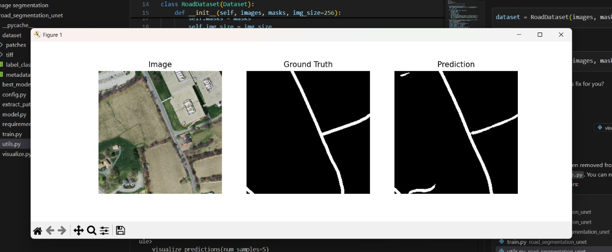
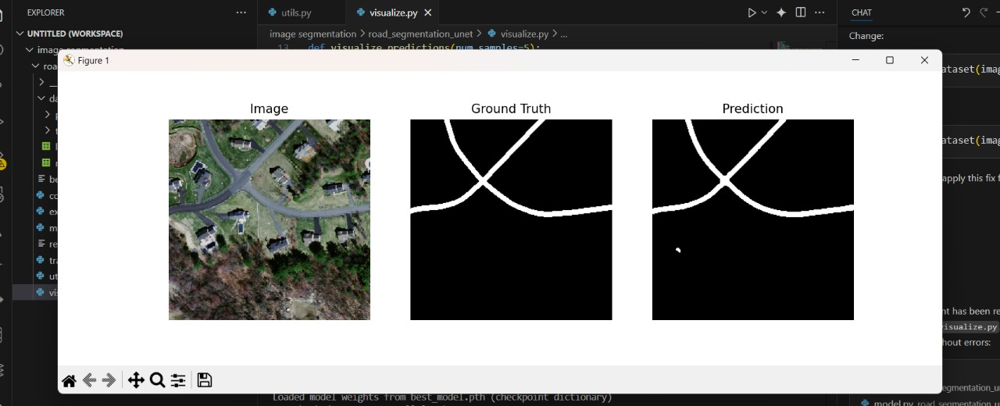
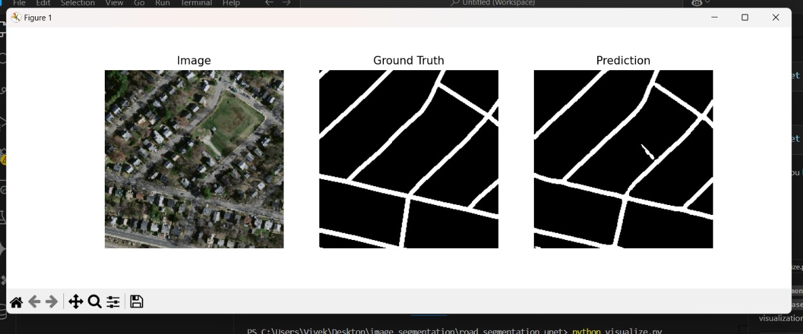

# Road Segmentation with U-Net

This project implements a U-Net-based deep learning pipeline for road segmentation from satellite images. The workflow includes patch extraction, model training, and visualization of results.

## 🚀 Web Application

Try the live demo: Upload your satellite images and get road segmentation predictions in real-time!


## Results
Below are three test examples from the trained model (input, ground truth, and prediction shown in order for each test):





> **Note:** Place your result images in a `results/` folder at the project root for the images above to render correctly.

## Folder Structure

```
road_segmentation_unet/
├── dataset/
│   ├── patches/
│   │   ├── images/   # Satellite image patches (input)
│   │   └── masks/    # Corresponding binary masks (ground truth)
│   └── tiff/         # (Optional) Original TIFF images and labels
├── best_model.pth    # Saved model weights
├── config.py         # Configuration and hyperparameters
├── extract_patches.py# Script to extract patches from TIFF images
├── model.py          # U-Net model definition
├── requirements.txt  # Python dependencies
├── train.py          # Model training script
├── utils.py          # Data utilities and metrics
├── visualize.py      # Visualization of predictions
└── README.md         # Project documentation
```

## Dataset
- **Input:** Satellite images and their corresponding binary road masks.
- **Format:** Images and masks are stored as 256x256 PNG patches in `dataset/patches/images` and `dataset/patches/masks`.

## How to Use

### 1. Install Requirements
```
pip install -r requirements.txt
```

### 2. Extract Patches (if needed)
If you have original TIFF images, run:
```
python extract_patches.py
```
This will create 256x256 patches in `dataset/patches/images` and `dataset/patches/masks`.

### 3. Train the Model
```
python train.py
```
- Training uses all available patches.
- The best model (by validation Dice score) is saved as `best_model.pth`.

### 4. Visualize Results
```
python visualize.py
```
- Shows side-by-side input, ground truth, and predicted mask for random samples.

## Model
- **Architecture:** U-Net (configurable input/output channels)
- **Loss:** Binary Cross-Entropy with Logits
- **Metric:** Dice Coefficient

## Acknowledgements
- U-Net: [Ronneberger et al., 2015](https://arxiv.org/abs/1505.04597)
- Satellite imagery dataset: Massachusetts Roads Dataset (or your own)

---

**Author:** Prabhash aj
**Date:** July 2025
